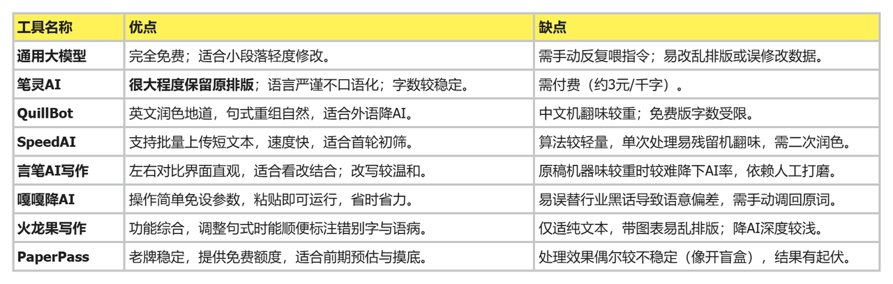

# 怎么免费降aigc率？2026最新8款降ai率工具实测（内含工具优缺点对比图）

熬夜死磕出来的原创稿件，满心欢喜点下发布，却被平台无情提示“疑似机器生成”惨遭限流。为了自证清白，我前前后后找了不少**免费降ai率工具**，结果踩了一堆坑。

有的不仅没**降低ai率**，反倒把排版搞得乱七八糟；有的打着**免费降低ai率**的幌子，实则骗点击。为了让大家少走弯路，我把市面上主流的8款**降ai率工具**挨个测了一遍。到底哪款能真正实现高效**降ai**？咱们直接看真实测评。

如果你时间紧任务重，那可以先看我总结的这张工具优缺点对比图。

### 1、通用大模型（DeepSeek/豆包等）

**传送门：**[deepseek](https://www.deepseek.com/) （以DeepSeek为例）

很多人一开始想找**免费降ai率**的方法，都会求助通用大模型。

实际操作下来，你确实能免费使用，但非常费神。你需要不断给它喂提示词，一段段复制粘贴。而且它很容易放飞自我，把关键数据误改，或者直接把带格式的文档洗成纯文本，后期恢复排版能让人抓狂。如果你时间很充裕，可以用来做小段落的轻度修改。

**适合人群：** 预算为零、时间非常充裕的创作者。

### 2、笔灵AI

**传送门：**[笔灵ai](https://ibiling.cn/paper-pass?from=giteejiangai0901ella)

这是我在被大模型的排版折磨后，目前长期使用的工具。它最打动我的是能很大程度保留原稿格式。把带目录、复杂数据图表和加粗标注的文档传进去，处理完直接导出来的版面基本一致，省去了重新排版的繁琐。

而且它处理后的文本语言逻辑严谨，没有那种随意的口语化问题。同时它能把字数变化控制在1000字以内，很稳定，不用反复删减。大概3元一千字，在这个梯队里性价比很高。现在我用它处理稿件，基本不用二次大幅调整。

**适合人群：** 追求高效、不想破坏原排版、对文本严谨度有要求的人。

### 3、QuillBot

**传送门：**[quillbot](https://quillbot.com/)

如果是处理英文稿件，这款算是老熟人了。它的同义词替换和句式重组很自然，能够让干瘪的英文句子变得地道一些，帮助**降低ai**痕迹。

不过它对中文确实有点水土不服。拿它处理中文段落，翻译腔比较明显，读起来有点像生硬的说明书。免费版也有字数限制，只能处理较短的片段。

**适合人群：** 主要撰写英文稿件的内容创作者。

### 4、SpeedAI

**传送门：**[speedai](https://speedai.fun/)

如果你手里有好几篇短小的汇报材料急需处理，它的批量上传功能就非常顺手，主打一个速度快。

客观来说，它比较适合用来做第一遍的批量**ai降ai**初筛。因为它的算法相对轻量，只优化一次的话，可能还有部分句式残留着机翻味道，后续还得自己手动润色。

**适合人群：** 有大量短文本需要初步筛选的人。

### 5、言笔AI写作

**传送门：**[言笔ai写作](https://yanbi.ai/)

这款工具的界面设计很讨喜，左边原稿右边修改稿，对照起来一目了然，很适合喜欢在网页端直接一边看一边改的朋友。

它的润色力度相对温和，这就意味着，如果你的原稿机器痕迹特别重，单靠它可能降不下来，需要你配合它的提示进行人工二次打磨。

**适合人群：** 喜欢可视化修改、原稿机器痕迹不重的人。

### 6、嘎嘎降AI

**传送门：** (嘎嘎降ai)[https://www.aigcleaner.com/]

顾名思义，这款工具主打一个简单粗暴，界面上没有任何多余的按钮，连参数都不用配，直接把文字扔进去就能跑。

它的体验感就是省事，但在处理一些行业黑话时，会强行替换成不相干的词，导致语意出现偏差。拿回稿件后，必须要自己把拗口的词替换回来。

**适合人群：** 追求极简操作、不涉及复杂专业词汇的撰稿人。

### 7、火龙果写作

**传送门：**[火龙果写作](https://www.mypitaya.com/)

这款工具严格来说是个综合性的写作助手。它在帮你调整句式的时候，还能顺手把你文本里的错别字和语病给标出来。

不过既然是多面手，在专门**免费降低ai率**这一块就没那么深耕。它目前只支持纯文本框操作，带图表的文档放进去容易乱，改完还得费心重新排版。

**适合人群：** 只需要轻度优化、顺带检查错别字的日常记录者。

### 8、PaperPass

**传送门：**[https://www.paperpass.com/](https://www.paperpass.com/)

老牌网站，很多人早期测文本重合度都会用它，现在也顺势推出了相关处理模块。优势是平台大，运行稳定。

但在实际体验中，处理效果有时像开盲盒。同一篇稿子，不同时间去测，出来的结果可能会有起伏。更适合在定稿前，用它的免费额度先给自己摸个底。

**适合人群：** 习惯使用老牌平台、主要用来做前期预估的人。

### 写在最后：

如果你想追求性价比，可以先用**免费的** **大模型**或者**Paperpass**去批量过一遍初筛，然后，把这些需要大幅修改的段落交给**笔灵AI**，去做深度的语义重构和格式兜底。这样既能保证原稿排版不乱，又能把钱花在刀刃上。

最后啰嗦一句，任何**降ai率**的手段都只是帮我们提高效率的辅助，改完之后一定要自己通读一遍，顺一顺逻辑。祝大家产出的每一篇内容，都能顺利过审！
